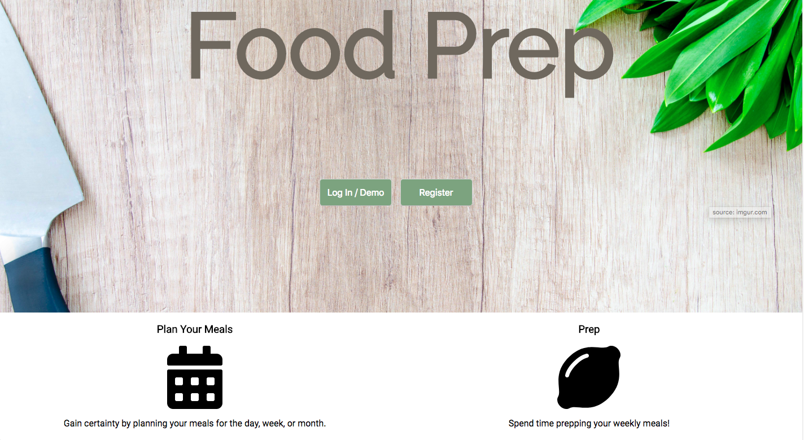
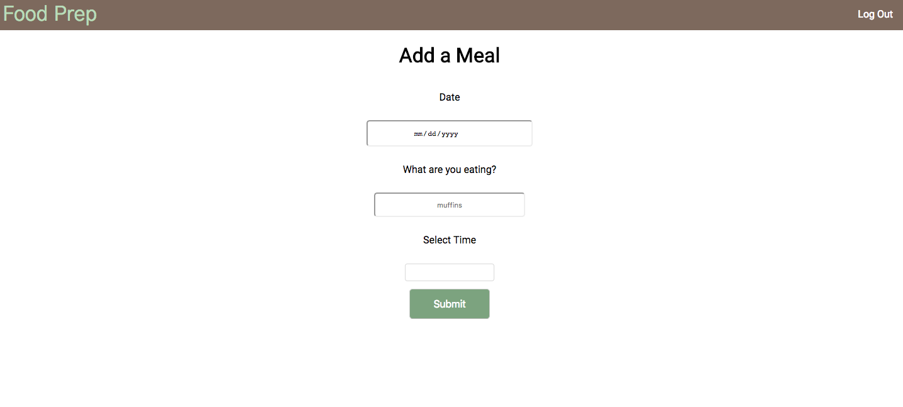
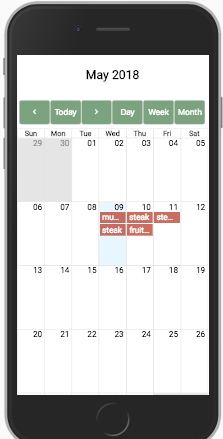

# Food Prep

Food Prep is a meal planning app to give certainty and peace of mind for your next meal.

## Tech

Food Prep is a React & Redux app on the front end, using a number of React libraries such as React Router, React Big Calendar, and Redux Form. Node, Express, and Mongoose were used on the backend. Add, edit, and delete meals from the calendar. Link to the backend code:

## Responsive

Mobile-forward design

